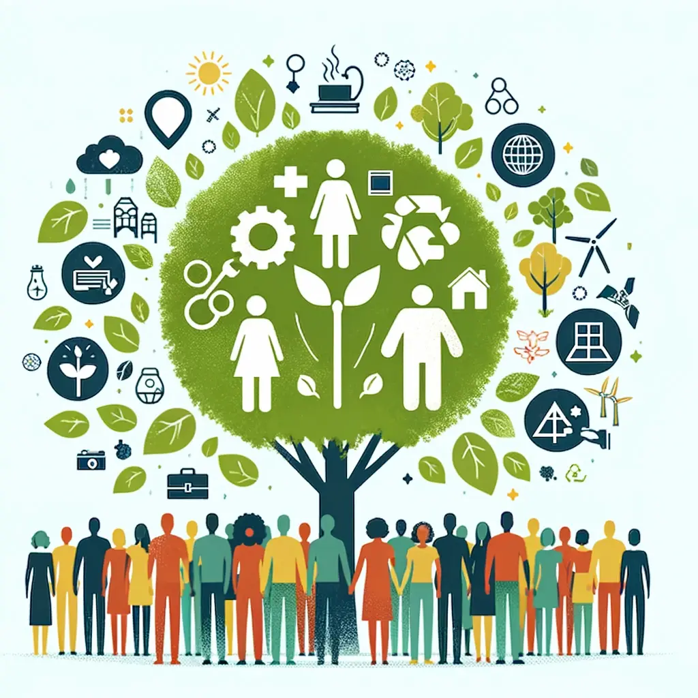

# La Sostenibilidad y el Desarrollo Sostenible
## Índice
 
1.1.  

1.2.  

1.3.  

1.4.  

1.5.  

1.6.-  

 Falta

 Falta

Referencias

](https://www.acciona.com/es/desarrollo-sostenible/)

https://www.un.org/sustainabledevelopment/es/objetivos-de-desarrollo-sostenible/

https://www.pactomundial.org/noticia/la-sostenibilidad-empresarial-desde-las-siglas-asg-o-esg/

https://www.pactomundial.org/noticia/6-leyes-y-directivas-sobre-sostenibilidad-que-afectaran-a-tu-empresa/

https://copade.es/diez-pasos-para-medir-el-desempeno-en-sostenibilidad-de-las-empresas/

Autores

D.S.R

I.B.L

G.C.R
