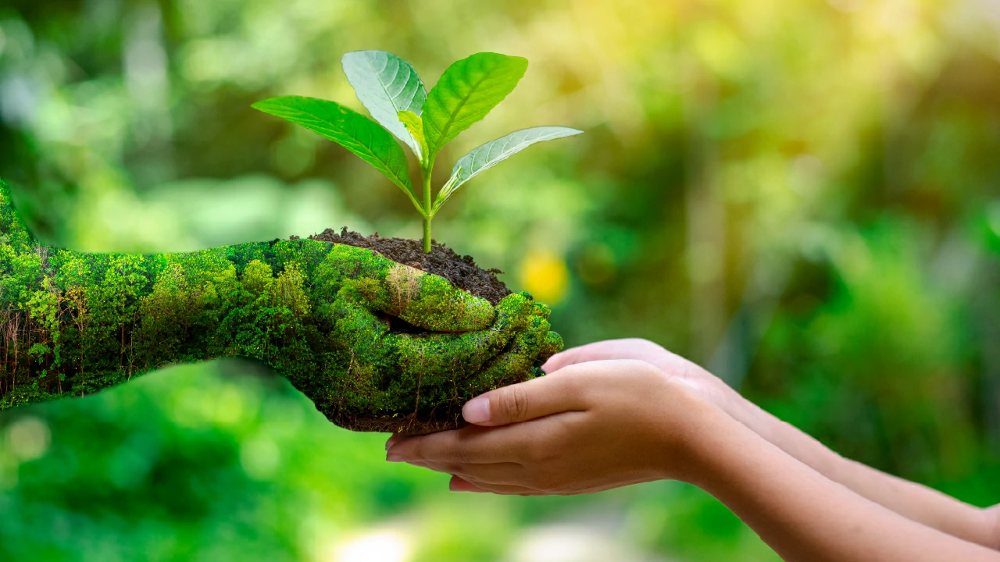

# Sostenibilidad Y Desarrollo Sostenible
## ¿En Qué Consiste?

La Sostenibilidad es el desarrollo que satisface las necesidades del presente sin comprometer la capacidad de las futuras generaciones, garantizando el equilibrio entre el crecimiento economico, el cuidado del medio ambiente y el bienestar social.

Aparece por primera vez en 1987 con la publicación del Informe Brundtland, que alertaba de las consecuencias medioambientales negativas del desarrollo económico y la globalización y trataba de buscar posibles soluciones a los problemas derivados de la industrialización y el crecimiento de la población.

## ¿Cuantos Tipos Hay?

### Sostenibilidad Ambiental

En su vertiente ambiental, la sostenibilidad defiende que la naturaleza no es una fuente ingotable de recursos y vela por su protección y uso racional.

Aspectos como el cuidado del medio ambiente, energias renovables, ahorro del agua, etc, contribuyen a lograr esta meta.

### Sostenibilidad Social
